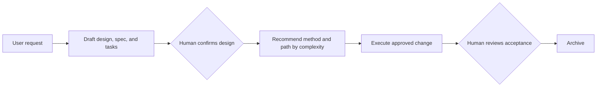
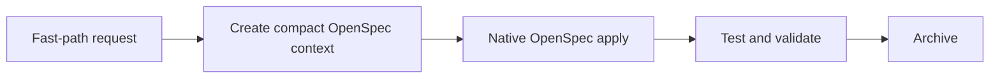

# OneSpec

> 中文说明见 [README-zh.md](README-zh.md)

OneSpec is a CLI and agent skill bundle for running an OpenSpec + Superpowers workflow.

## What It Does

### `onespec`

`onespec` turns OpenSpec from a set of manual commands into an agent-operated workflow. It prepares the design, spec, and task artifacts, asks the human to confirm the design before implementation, recommends the implementation method and path based on complexity, then carries the change through execution, review, and archive.

Use it when a change needs normal design confirmation and acceptance review. You invoke the workflow in natural language instead of manually chaining multiple OpenSpec commands.

### `onespec-fast`

`onespec-fast` is the shorter path for explicitly automatic OpenSpec changes. It creates the needed OpenSpec context, skips the complexity check, uses native `OpenSpec apply`, runs validation, and archives directly.

## Workflow

`onespec`



`onespec-fast`



## Install

Requires:

- Node.js 20+
- npm / npx
- a shell with `bash`

Global install:

```bash
npm install -g @kafka0102/onespec
```

Run without a global install:

```bash
npx -y @kafka0102/onespec init
```

If you use `npx`, run other commands the same way, for example:

```bash
npx -y @kafka0102/onespec doctor . --scope project
```

## Quick Start

```bash
cd your-project
onespec init
```

Then run:

```bash
onespec doctor . --scope project
```

After `onespec init`, restart the agent session and use natural language, for example:

```text
use onespec: design a login audit feature
use onespec: apply the approved change for login audit
use onespec: review and archive the login audit change
use onespec-fast: add a validation message
```
